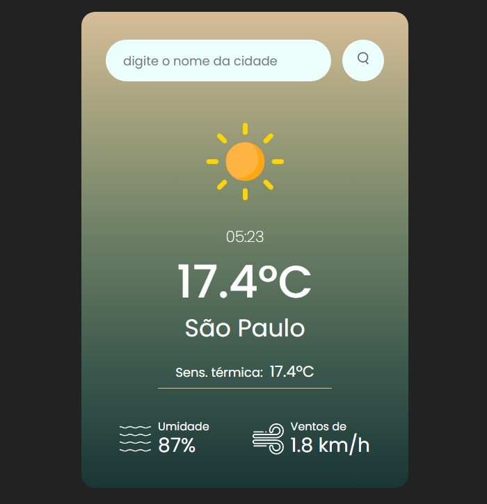

# Weather App

Este é um aplicativo simples que fornece as condições meteorológicas de qualquer cidade do mundo. Ele utiliza a API OpenWeatherMap para obter dados do clima e exibe informações como temperatura, sensação térmica, umidade, vento, entre outras.

## Funcionalidades

- **Exibição das condições meteorológicas**: O app exibe dados como a temperatura atual, sensação térmica, umidade e velocidade do vento.
- **Cálculo do horário local**: A hora local da cidade pesquisada é calculada com base no fuso horário fornecido pela API.
- **Interação com o dia e a noite**: O fundo e os ícones do clima mudam de acordo com a hora do dia (dia/noite) e as condições meteorológicas.

## Tecnologias Utilizadas

- **HTML**: Estrutura da página.
- **CSS**: Estilo da página (com gradientes e ícones adaptativos).
- **JavaScript**: Lógica para interação com a API e exibição dinâmica dos dados.
- **API OpenWeatherMap**: Para fornecer dados meteorológicos.

## Como Funciona

1. **Pesquisa do Clima**: O usuário pode inserir o nome de uma cidade na caixa de pesquisa e pressionar o botão para visualizar as condições climáticas dessa cidade.
2. **Exibição do Clima**: O aplicativo exibe informações como:
   - Nome da cidade
   - Temperatura atual
   - Sensação térmica
   - Humidade
   - Velocidade do vento
3. **Hora Local**: A hora local da cidade é calculada com base no fuso horário retornado pela API.
4. **Interação Dia/Noite**:
   - **Dia**: Se a hora local está entre 6h e 19h, o fundo da card tem tons claros e o ícone do clima corresponde ao estado do tempo.
   - **Noite**: Se a hora local está entre 20h e 5h, o fundo da card fica escuro, e o ícone do clima muda para representar a noite (como uma lua crescente).
5. **Ícones do Clima**: O ícone de clima muda de acordo com as condições meteorológicas (ex: sol, nuvens, chuva, névoa).

## Aplicativo em funcionamento



## Como Usar

1. Clone o repositório para seu computador:
   ```bash
   git clone https://github.com/seu-usuario/weather-app.git
